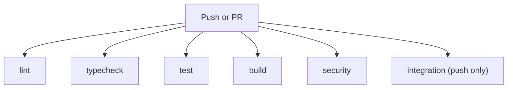

# CI Pipeline — nikkoe-frontend

This document explains every part of the CI pipeline defined in `ci.yml`, why each job exists, and how the pieces fit together.

---

## What Is CI?

**CI (Continuous Integration)** automatically checks every code change for problems — lint errors, type errors, test failures, build breakage, security vulnerabilities — before it can be merged. It runs on every push and pull request so that broken code is caught immediately, not after it reaches users.

---

## When Does the Pipeline Run?

```yaml
on:
  push:
    branches: [hexa-nikkoe, main]
  pull_request:
    branches: [hexa-nikkoe, main]
```

The pipeline triggers on:

- **Every push to `hexa-nikkoe` or `main`** — full pipeline including integration tests.
- **Every pull request targeting those branches** — all checks except integration tests (see below for why).

Two branches are monitored because `hexa-nikkoe` serves as a development/feature branch that also requires quality guarantees.

---

## Concurrency Controls

```yaml
concurrency:
  group: ${{ github.workflow }}-${{ github.ref }}
  cancel-in-progress: true
```

**Why:** Rapid pushes to the same branch trigger multiple pipeline runs. Only the latest one matters. This setting automatically cancels stale runs, saving CI minutes and avoiding confusing results from outdated code.

---

## Pipeline Architecture: Parallel Jobs

Unlike a sequential pipeline where each step waits for the previous one, this pipeline runs **six independent jobs in parallel**:



**Why parallel?** Each job checks a different dimension of code quality. A lint failure doesn't affect whether the build succeeds, so there's no reason to wait. Running in parallel means:

1. **Faster feedback** — all results arrive at roughly the same time instead of sequentially.
2. **Granular status checks** — on a PR, you see six separate green/red indicators. If `typecheck` fails but `test` passes, you know exactly what to fix without reading logs.
3. **Independent failures** — a flaky test doesn't block you from seeing lint or build results.

---

## Job: `lint`

```yaml
- name: Lint
  run: npm run lint
```

Runs ESLint against the entire codebase. The ESLint configuration (`eslint.config.js`) enforces:

- **TypeScript-ESLint recommended rules** — catches TypeScript-specific mistakes
- **React Hooks rules** — ensures hooks are called in the correct order and with correct dependencies
- **React Refresh rules** — ensures components are compatible with hot module replacement during development

**Why:** Linting catches bugs and anti-patterns statically (without running the code). Common catches include: missing hook dependencies that cause stale state, incorrect conditional hook calls that crash React, and unused variables that indicate dead code or typos.

---

## Job: `typecheck`

```yaml
- name: Type check
  run: npm run typecheck
```

Runs the full TypeScript compiler (`tsc --noEmit`) across the entire project. The `--noEmit` flag means it only checks types without producing output files.

**Why this exists separately from `build`:** Vite (the build tool) uses SWC for speed and **intentionally skips type checking** during builds. This means `npm run build` can succeed even when the code has type errors. Running `tsc` explicitly catches:

- Incorrect function argument types
- Missing required props on components
- Type mismatches between API responses and the TypeScript interfaces
- Incorrect usage of nullable values

As the application grows and types become more complex (API types, form schemas, state management), this check becomes increasingly valuable. A type error caught in CI is a bug prevented in production.

---

## Job: `test`

```yaml
- name: Unit tests
  run: npm test
```

Runs the unit test suite using Vitest (`vitest run`). These tests use jsdom to simulate a browser environment and Testing Library for component testing.

**What's tested:** Unit tests in `src/test/` cover schema validation, component rendering, and isolated logic. They run fast (seconds) because they don't hit real APIs.

**Why:** Tests verify that code does what it's supposed to do. Linting checks how code is written; tests check what code does. Without tests, refactoring is dangerous — you can't know if your changes broke something until a user reports it.

---

## Job: `build`

```yaml
- name: Build
  run: npm run build
```

Runs a full production build with Vite. This compiles TypeScript, bundles all modules, processes CSS (Tailwind), and optimizes assets.

**Why:** A successful build proves that:

- All imports resolve (no missing modules or circular dependencies that break at bundle time)
- CSS processing succeeds (no invalid Tailwind classes or PostCSS errors)
- The output is a valid, deployable artifact

Build failures that don't show up during development (because Vite's dev server is more permissive) are caught here.

---

## Job: `security`

```yaml
- name: Security audit
  run: npm audit --audit-level=high
```

Runs npm's built-in security audit against the [GitHub Advisory Database](https://github.com/advisories). It checks every dependency (and transitive dependency) for known vulnerabilities. `--audit-level=high` means only high and critical severity issues fail the pipeline — low/moderate advisories are reported but don't block.

**Why:** This application handles authentication tokens, financial data, and connects to Supabase. A compromised dependency (supply chain attack) or a known vulnerability in React, Vite, or any Radix UI component could expose user data. The audit runs in ~2 seconds and catches these automatically.

---

## Job: `integration`

```yaml
integration:
  if: github.event_name == 'push'
  ...
  - name: Integration tests
    run: npm run test:integration
    env:
      VITE_SUPABASE_URL: ${{ secrets.SUPABASE_URL }}
      VITE_SUPABASE_ANON_KEY: ${{ secrets.SUPABASE_ANON_KEY }}
```

Runs the integration test suite (`vitest.integration.config.ts`) which tests against a live Supabase instance. These tests verify real CRUD operations — creating categories, items, locations, receipts, sales, and suppliers.

**Why push-only (`if: github.event_name == 'push'`):** Integration tests need real Supabase credentials stored as GitHub secrets. Pull requests from forks (or from contributors without repo access) cannot access secrets — this is a GitHub security feature to prevent malicious PRs from exfiltrating credentials. Restricting to pushes means only trusted, merged code runs against the real database.

**Why separate from unit tests:** Integration tests are slower (they hit a real database), sequential (to avoid race conditions), and require secrets. Keeping them separate means:

- Unit tests give fast feedback on every PR
- Integration tests give deeper confidence after merge
- A flaky network call in integration tests doesn't block the lint/build/typecheck feedback loop

---

## How to Modify This Pipeline

### Adding a new parallel check
Add a new job at the top level of the `jobs:` section. Copy the setup steps (checkout, setup-node, npm ci) and add your check. It will automatically run in parallel with existing jobs. Example:

```yaml
my-new-check:
  runs-on: ubuntu-latest
  steps:
    - uses: actions/checkout@v4
    - uses: actions/setup-node@v4
      with:
        node-version: 20
        cache: npm
    - run: npm ci
    - name: My check
      run: npm run my-check
```

### Adding a deployment job
To add CD (Continuous Deployment), add a new job with `needs: [lint, typecheck, test, build]` so it only runs after all checks pass, and gate it with `if: github.ref == 'refs/heads/main' && github.event_name == 'push'`.

### Adding integration test secrets
If the integration tests need additional environment variables:

1. Add the secret in GitHub: Repository Settings > Secrets and variables > Actions
2. Reference it in the `integration` job's `env` block: `MY_VAR: ${{ secrets.MY_SECRET }}`

---

## Files Involved

| File | Purpose |
|------|---------|
| `.github/workflows/ci.yml` | The pipeline definition (this document explains it) |
| `package.json` | Script definitions (`lint`, `test`, `typecheck`, `build`, `test:integration`) |
| `eslint.config.js` | ESLint rules and configuration |
| `tsconfig.json` / `tsconfig.app.json` | TypeScript compiler configuration |
| `vitest.config.ts` | Unit test configuration (jsdom, excludes integration) |
| `vitest.integration.config.ts` | Integration test configuration (node, sequential, 15s timeout) |
| `src/test/` | Test files, helpers, and setup |
| `vite.config.ts` | Build tool configuration |
